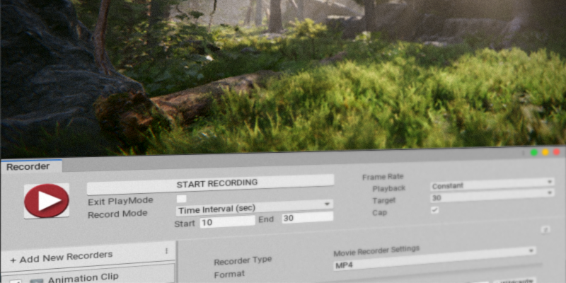

# About Recorder

Use the Recorder package to capture and save data during [Play mode](https://docs.unity3d.com/Manual/GameView.html). For example, you can capture gameplay or a cinematic and save it as a video file.

>[!NOTE]
>You can only use the Recorder in the Unity Editor. It does not work in standalone Unity Players or builds.

## Recording

You can set up and launch recordings in two ways:

- From the [Recorder window](RecordingRecorderWindow.md).

- Through a [Recorder Clip](RecordingTimelineTrack.md) within a [Timeline](https://docs.unity3d.com/Packages/com.unity.timeline@latest) track.

## Available recorder types

### Default recorders

The Recorder includes the following recorder types by default:

* **Animation Clip Recorder:** generates an animation clip in Unity Animation format (.anim extension).

* **Movie Recorder:** generates a video in H.264 MP4, VP8 WebM, or ProRes QuickTime format.

* **Image Sequence Recorder:** generates a sequence of image files in JPEG, PNG, or EXR (OpenEXR) format.

* **Audio Recorder:** generates an audio clip in WAV format.

* **AOV Recorder:** generates a sequence of image files in JPEG, PNG, or EXR (OpenEXR) format, to capture specific render pass data (for example, data related to materials, geometry, depth, motion, or lighting) in projects that use Unity's [HDRP (High Definition Render Pipeline)](https://docs.unity3d.com/Packages/com.unity.render-pipelines.high-definition@latest).

>**Note:** The AOV Recorder included in this version of the Recorder package replaces the one that was formerly available through a separate package. If you previously installed the separate AOV Recorder package, you should uninstall it to avoid any unexpected recording issues.

### Additional recorders

You can also benefit from additional Recorder types if you install specific packages along with the Recorder:

* The [Alembic for Unity](https://docs.unity3d.com/Packages/com.unity.formats.alembic@latest) package includes an **Alembic Clip Recorder**, which allows you to record and export GameObjects to an Alembic file.

* The [FBX Exporter](https://docs.unity3d.com/Packages/com.unity.formats.fbx@latest) package includes an **FBX Recorder**, which allows you to record and export animations directly to FBX files.

## Package technical details

### Installation

To install this package, follow the instructions in the [Package Manager documentation](https://docs.unity3d.com/Manual/upm-ui-install.html).

### Requirements

This version of the Recorder is compatible with the following versions of the Unity Editor:

* 2022.1 and later (recommended)

### Known issues and limitations

See the list of current [known issues and limitations](KnownIssues.md) that you might experience with the Recorder, and their workarounds.
